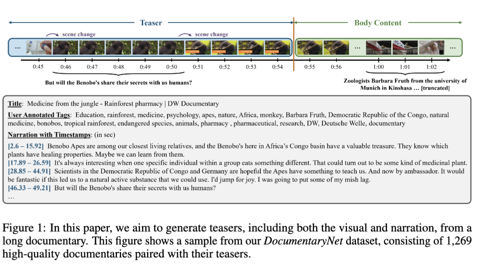
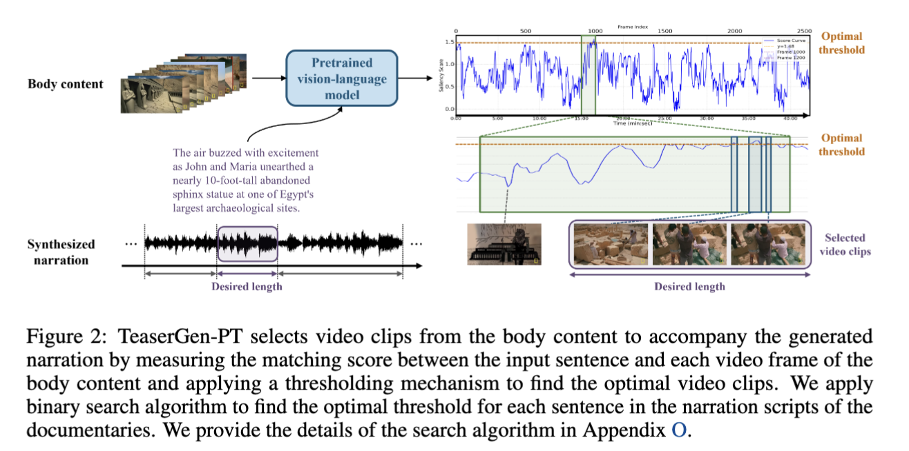
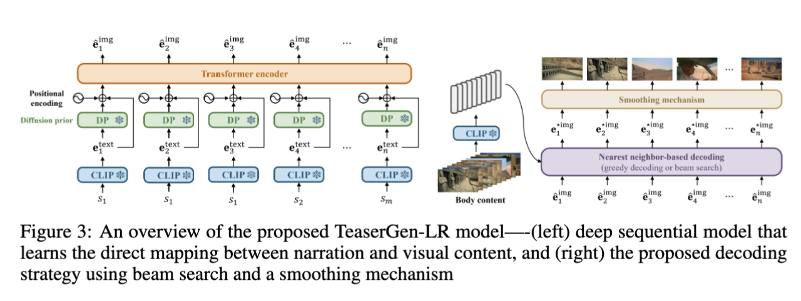

# TeaserGen: Generating Teasers for Long Documentaries

This repository contains the official implementation of "TeaserGen: Generating Teasers for Long Documentaries"(*The codebase is still under construction.*)

**TeaserGen:Generating Teasers for Long Documentaries**

Weihan Xu, Paul Pu Liang , Haven Kim, Julian McAuley, Taylor Berg-Kirkpatrick, Hao-Wen Dong

The International Conference on Learning Representations (ICLR), 2025

[[Paper](https://arxiv.org/pdf/2410.05586)] [[Demo Page](https://wx83.github.io/TeaserGen_Official/)] [[Pretrained Model](https://drive.google.com/drive/folders/1A35frASy1fkLKzfEpPs2unBEYg1fpR6R?dmr=1&ec=wgc-drive-globalnav-goto)]

## Contents
0. [x] Overview
1. [x] Environment
2. [x] Dataset Annotation and Processing
3. [x] Narration Generation
4. [x] TeaserGen-PT 
5. [x] TeaserGen-LR 
6. [x] Evaluation
7. [x] Final Note
8. [x] Acknowledgement
9. [x] Citation
10. [ ] Interactive Demo on Gradio: Coming Soon!

## Overview

Dataset Annotation Overview:


TeaserGen-PT:


TeaserGen-LR:



## Environment

```bash
conda env create -f newgpt.yml
```

## Dataset Annotation and Processing
We annotate the separating point of teaser and main documentary and saved in annotation/annotation.csv.

You can find detailed data processing code under ./data_preprocessing

The general pipeline for data processing:

1) Download Raw data from youtube: video_download.py

2) Preprocess raw video by separating the audio track from the video: video_preprocessing.py

3) Audio Separation: audio_preprocess.py

4) Transcription: Timestamped-whisper or whisperX

5) Prepare your CLIP feature: Extract frames from video with frame_extraction.py and then use clip_frame_feat_extractor.py and clip_text_feat_extractor.py

*We also provide additional processing on scene at scene_process.py*

## Narration Generation
1) Input your transcribed text into narr_gen/text_gpt4.py and generate narrations

2) Get audio track and correponding audio length with narr_gen/text2speech.py

## TeaserGen-PT 
If you want to use the pretrained model from UniVTG: You can find code ./teasergen-pt/gpt_tf_queue.py 

If you want to use the finetuned model on DocumentaryNet: You can find code ./teasergen-pt/gpt_ft_queue.py 

## TeaserGen-LR 
1) Prepare your training dataset: ./teasergen_lr/prepare_dataset.py

2) Training: ./train_epoch.py and ./train_step.py

3) Decoding: inference.py


## Evaluation:
1) Generate vtgscore array: vtgscore.py

2) Evaluate finetuned highlight detection model: highlight_eval.py

3) Evaluation: ./eval/evaluation.py

## Acknowledgement
WhipserX is based on [WhipserX](https://github.com/m-bain/whisperX)

Audio Separation is based on [CDX](https://gitlab.aicrowd.com/yoyololicon/cdx-submissions)

TeaserGen-PT is based on [UniVTG](https://github.com/showlab/UniVTG/)

We thank the authors for their open-source contributions.


## Final Note

Due to copyright concerns, we are unable to release the raw data. However, please note that processing some videos may require YouTube Premium. If you encounter any issues with your data or have any questions, feel free to reach out to me at weihan.xu@duke.edu. 


## Citation

```bibtex
@inproceedings{xu2025teasergen,
    title={TeaserGen: Generating Teasers for Long Documentaries},
    author={Weihan Xu and Paul Pu Liang and Haven Kim and Julian McAuley and Taylor Berg-Kirkpatrick and Hao-Wen Dong},
    booktitle={International Conference on Learning Representations},
    year={2025}
}
```

